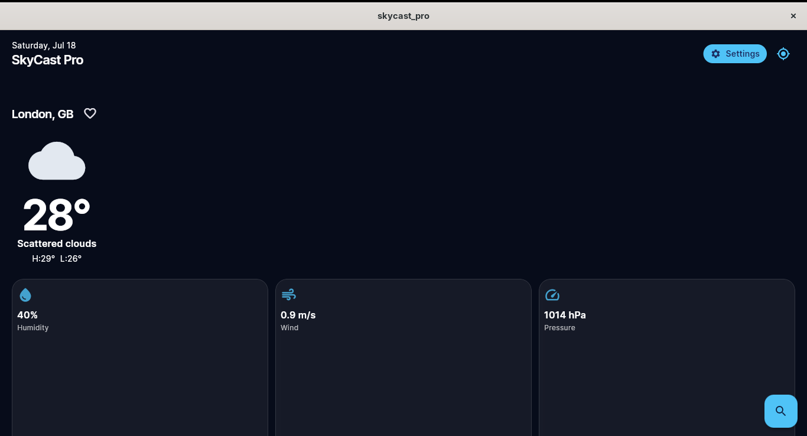
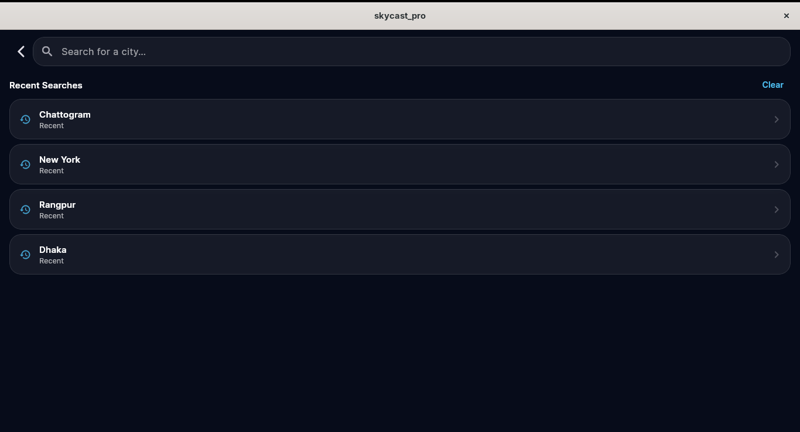
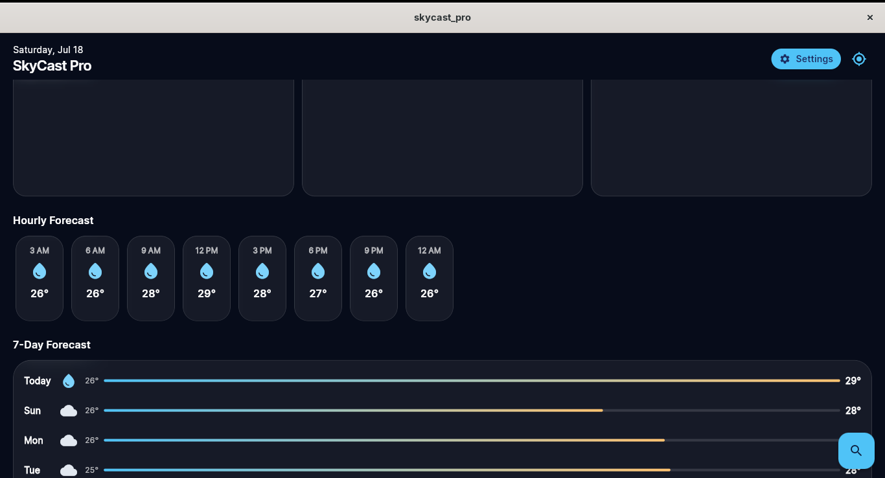
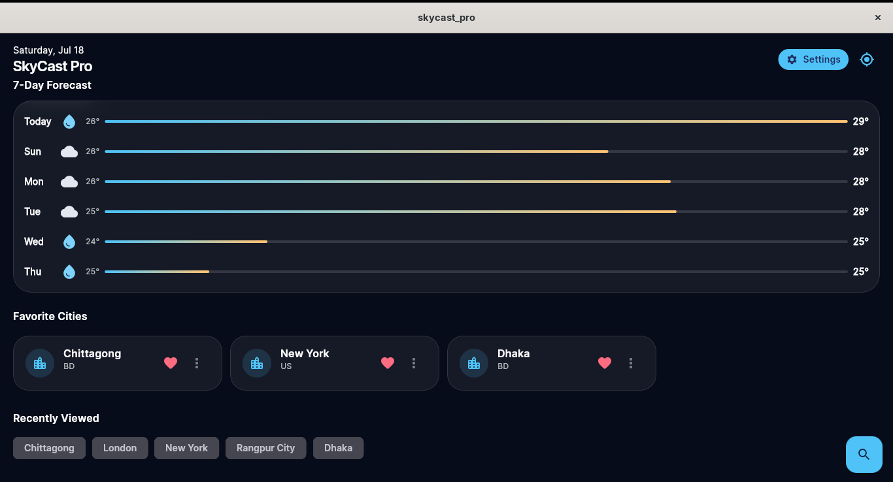
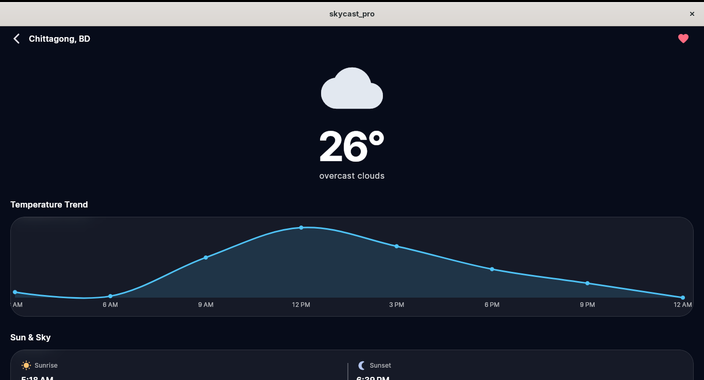
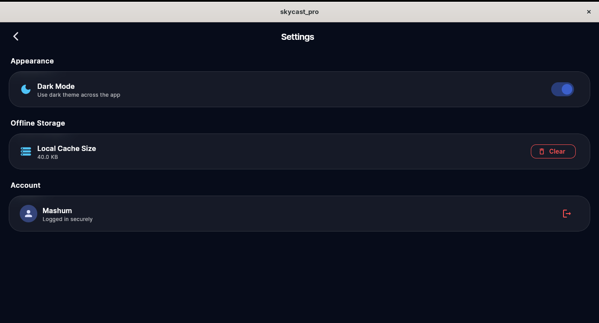

# 🌦️ SkyCast Pro

<p align="center">
  <b>A Premium Weather Application built with Flutter</b>
</p>

<p align="center">
Real-time Weather • Hourly Forecast • Weekly Forecast • SQLite • Riverpod • Clean Architecture
</p>

---

# 📖 Overview

SkyCast Pro is a modern weather application developed using Flutter. It provides real-time weather information, hourly and weekly forecasts, weather maps, favorite city management, and offline caching. The application follows Clean Architecture with Riverpod state management to ensure scalability, maintainability, and high performance.

---

# ✨ Features

- 🌍 Current weather based on device location
- 🔍 Search weather by city name
- ⭐ Save & manage favorite cities
- 🕒 Hourly weather forecast
- 📅 7-Day weather forecast
- 🌡️ Temperature, Feels Like, Humidity
- 💨 Wind Speed
- 🌅 Sunrise & Sunset
- 🗺️ Weather Map
- 💾 SQLite Offline Cache
- 🌙 Dark & Light Theme
- 📊 Weather Statistics
- 📱 Responsive UI
- ✨ Glassmorphism Design
- 🔄 Pull to Refresh
- ⚡ Smooth Animations

---

# 🏗️ Project Architecture

The project follows **Clean Architecture**.

```
lib/
│
├── core/
├── data/
├── database/
├── domain/
├── presentation/
│   ├── providers/
│   ├── screens/
│   └── widgets/
│
├── routing/
│
└── main.dart
```

---

# 🌐 API Used

This application uses the **OpenWeatherMap API**.

### API Provider

https://openweathermap.org/api

### APIs Used

- Current Weather API
- 5 Day / 3 Hour Forecast API
- Geocoding API
- Weather Icons API

### Weather Information

- Current Temperature
- Feels Like
- Humidity
- Pressure
- Wind Speed
- Visibility
- Sunrise & Sunset
- Hourly Forecast
- Weekly Forecast

---

# 📦 Packages Used

| Package | Purpose |
|----------|----------|
| flutter_riverpod | State Management |
| dio | API Requests |
| go_router | Navigation |
| sqflite | SQLite Database |
| shared_preferences | Local Storage |
| connectivity_plus | Internet Connectivity |
| geolocator | Device Location |
| permission_handler | Runtime Permission |
| intl | Date Formatting |
| flutter_svg | SVG Support |
| cached_network_image | Image Caching |
| google_fonts | Custom Fonts |
| flutter_screenutil | Responsive UI |
| shimmer | Loading Animation |
| lottie | Animation |
| fl_chart | Weather Charts |
| logger | Logging |

---

# 📸 Application Screenshots

| 🏠 Home | 🔍 Search | 📅 Forecast |
|---------|-----------|-------------|
|  |  |  |

| ⭐ Favorites | 🗺️ Weather Map | ⚙️ Settings |
|-------------|----------------|-------------|
|  |  |  |

---

# 🚀 Getting Started

## Clone Repository

```bash
git clone https://github.com/mashum-saimon/skycast-pro.git
```

## Navigate to Project

```bash
cd skycast-pro
```

## Install Dependencies

```bash
flutter pub get
```

## Run the Project

```bash
flutter run
```

---

# 📦 Build APK

```bash
flutter build apk --release
```

APK Output Location

```
build/app/outputs/flutter-apk/app-release.apk
```

---

# 💻 Requirements

- Flutter SDK
- Dart SDK
- Android Studio / VS Code
- Android SDK
- Internet Connection

---

# 📁 Project Structure

```
skycast_pro/

android/

assets/

ios/

lib/

linux/

macos/

test/

web/

windows/

pubspec.yaml

README.md
```

---

# 👨‍💻 Developer

Abdullah Mashum

Bachelor of Science in Computer Science & Engineering (CSE)

International Islamic University Chittagong (IIUC)

---

# 🔗 GitHub Repository

https://github.com/mashum-saimon/skycast-pro

---

# 📄 License

This project was developed for educational and learning purposes.

---

<p align="center">
⭐ If you like this project, don't forget to give it a star on GitHub!
</p>
